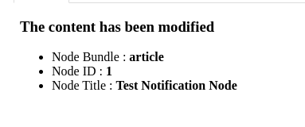

<strong>Notifications Drupal :</strong>  Ce projet fournit une solution simple pour envoyer des notifications par e-mail lorsque du contenu est modifi&eacute; sur un site Drupal. Il comprend un module personnalis&eacute; qui permet aux administrateurs de saisir une adresse e-mail de notification dans les param&egrave;tres du site, et chaque fois qu&#39;un contenu est mis &agrave; jour, une notification est envoy&eacute;e &agrave; cette adresse. Ce module est con&ccedil;u pour &ecirc;tre facilement int&eacute;gr&eacute; dans n&#39;importe quel site Drupal et peut &ecirc;tre personnalis&eacute; pour r&eacute;pondre &agrave; des besoins sp&eacute;cifiques.

<strong>Fonctionnalit&eacute;s principales :</strong>

<ul>
	<li>Configuration simple via l&#39;interface d&#39;administration Drupal.</li>
	<li>Envoi automatique d&#39;e-mails de notification lors de la modification du contenu.</li>
	<li>Personnalisation possible pour ajouter des fonctionnalit&eacute;s suppl&eacute;mentaires ou modifier le comportement par d&eacute;faut.</li>
	<li>Int&eacute;gration transparente avec d&#39;autres modules Drupal.</li>
</ul>
<h4>Exemple Email</h4>

